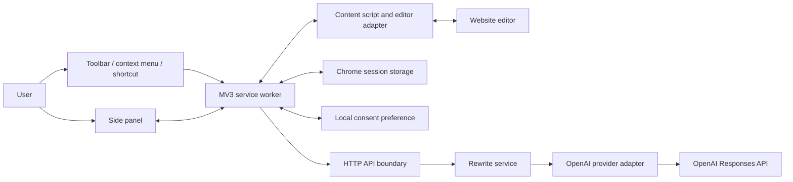

# Architecture

Implementation snapshot: 2026-09-05. This document describes the local MVP in
the repository. [Current status](../status.md) tracks verification and release
gaps. ADRs remain the authority for consequential decisions.

SmartAssistance is a privacy-first browser writing assistant. Architecture
decisions belong in `docs/decisions/`; ADR-0001 defines the initial runtime and
system boundary. ADR-0002 defines interaction identity, expiry, and bounded AI execution.

## Principles

- Start with the smallest deployable architecture that meets measured needs.
- Keep domain behavior separate from delivery mechanisms and external providers.
- Make boundaries, data ownership, and trust transitions explicit.
- Design AI calls as fallible external calls with budgets, timeouts, telemetry,
  evaluation, and safe fallback behavior.
- Prefer reversible decisions; document expensive or hard-to-reverse decisions.

## System context

```text
Web editor
    <-> content script
    <-> extension service worker and side panel
    <-> SmartAssistance API
    <-> model-provider adapter
    <-> OpenAI Responses API
```

The website owns the editor and draft. The extension temporarily owns an editor
snapshot and generated preview. The API processes a rewrite request without
persisting its text. OpenAI is an external processor reached only by the API.

## Components



### Source map and dependency direction

| Source | Responsibility |
| --- | --- |
| `apps/extension/src/sidepanel.ts`, `.html`, `.css` | Controls, consent disclosure, preview, copy, and user actions |
| `apps/extension/src/service-worker.ts` | Invocation, document targeting, shared interaction state, network requests, cancellation, expiry |
| `apps/extension/src/content-script.ts` | Validated Chrome messages into editor operations |
| `apps/extension/src/editor.ts` | Eligibility, complete-field capture, conflict detection, plain-text application, undo |
| `apps/extension/src/messages.ts` | Internal message validators, interaction identities, storage keys, expiry policy |
| `packages/contracts/src/index.ts` | Provider-independent public types and runtime validation |
| `apps/api/src/index.ts`, `config.ts` | Composition, environment validation, process startup and shutdown |
| `apps/api/src/http-server.ts`, `rate-limit.ts` | HTTP, origin/auth checks, admission limits, deadlines, safe logs |
| `apps/api/src/rewrite-service.ts` | Provider interface and result validation without HTTP or SDK dependencies |
| `apps/api/src/openai-rewrite-provider.ts` | SDK transport, cancellation, output checks, provider error mapping |
| `apps/api/src/rewrite-policy.ts` | Versioned writing-mode and style instructions |
| `apps/api/src/evaluations/` | Synthetic corpus, deterministic evaluator, opt-in live runner |

Both applications depend on contracts. The HTTP layer calls the domain service;
the composition root injects an adapter implementing `RewriteProvider`. The
domain service does not import Chrome, the HTTP server, or the OpenAI SDK.

### Chrome extension

- Uses Manifest V3 and the narrow `activeTab` permission.
- Captures a focused editor only after an explicit user gesture.
- Keeps DOM access inside a content script and network access inside the service
  worker.
- Provides writing-mode and output-language controls in a side panel; style is
  available only for writing improvement.
- Binds each generation to a tab, document, snapshot, and attempt ID. Serialized
  state transitions prevent older asynchronous results from becoming current.
- Compares the complete captured text and contenteditable markup before applying;
  retains one temporary undo value. See ADR-0002 for node restoration safeguards.
- Uses browser-native plain-text insertion for managed editors with Lexical/Draft
  markers, checking the resulting text after queued reconciliation. Undo on this
  path restores text rather than original nodes or formatting; see
  [ADR-0003](../decisions/0003-managed-editor-native-insertion.md).
- Requires versioned first-use consent at the service-worker boundary, scopes it
  to the configured API endpoint, and expires captures after ten minutes.

### Shared contracts

- Defines the public rewrite request, response, and error shapes. Chrome message
  shapes and their runtime validators live within the extension.
- Performs runtime validation at the API trust boundary.
- Contains no browser, HTTP, or model-provider behavior.

### SmartAssistance API

- Exposes health and rewrite endpoints.
- Enforces media type, origin, body-size, field, total deadline, process-wide
  request limits, and concurrent provider-call limits.
- Logs request identifiers and operational metadata without draft text.
- Allows anonymous access only in local development. Production must fail closed
  until application authentication is configured.

### Model-provider adapter

- Is the only component that imports the OpenAI SDK.
- Converts the provider-neutral rewrite request into a stateless Responses API
  request with `store: false` and no tools.
- Keeps operation policy in a separately versioned artifact and treats the editor
  text as untrusted data. Rejects refusal, incomplete, failed, and empty output.
- Uses no automatic retries, propagates cancellation, bounds output tokens, and
  returns token usage and provider request IDs for content-free server metrics.
- Disables SDK logging so environment-level debug settings cannot log draft bodies.

## Rewrite data flow

1. A user gesture grants temporary tab access and opens the side panel.
2. The content script validates the focused element and returns its plain text,
   expiry, and snapshot identifier. The worker records the top-level document ID.
3. The side panel submits the requested writing mode, optional improvement style,
   and language through the service worker.
4. The worker validates consent and the active snapshot, obtains text from its own
   capture, and sends the request over HTTPS (HTTP is allowed for loopback development).
   It never sends the page URL, surrounding DOM, or browsing history.
5. The API validates and rate-limits the request, then calls the configured model
   provider with a server-side credential.
6. The side panel previews the response. Replacement requires an explicit click.
7. The worker permits replacement only for the completed generation. The content
   script checks snapshot identity, expiry, editor eligibility, and unchanged content.

Trust boundaries exist between the website and content script, between extension
contexts, at the public API, and at the model-provider API. Every message and
response crossing those boundaries is validated. Model output is inserted as
text, never interpreted as HTML or code.

## Data ownership and retention

- The single current draft uses Chrome session storage; previews remain in panel
  memory and editor undo data in the content script. Recapture, navigation, source
  tab closure, clearing, and expiry invalidate the interaction and clear its state.
- A Chrome alarm supports cleanup while the MV3 worker is suspended. Absolute expiry
  is also checked before use; physical cleanup resumes when Chrome schedules work.
- Incompatible session state from previous versions is removed on startup.
- Extension preferences may use local Chrome storage; drafts must not use synced
  or persistent storage.
- The MVP API has no application database and must not log request bodies.
- Production analytics may record request ID, duration, character count, model,
  token usage, operation, status, and coarse language code only.
- Provider retention and data-residency settings remain an explicit deployment
  responsibility; see [privacy and retention](../privacy.md).

## Runtime and deployment

### HTTP contract

| Endpoint | Behavior |
| --- | --- |
| `GET /healthz` | Returns `status` and `providerConfigured`; missing development credentials produce `degraded` with HTTP 200. This does not probe the provider. |
| `POST /v1/rewrites` | Accepts JSON containing only `text`, `operation`, optional `tone`, and `targetLanguage`; returns `rewrittenText`, `requestId`, and `model`. |
| `OPTIONS` | Returns CORS preflight headers for an allowed origin. |

Operations are `grammar` and `improve`. Grammar correction does not accept a
tone and preserves the draft's existing style. Writing improvement requires a
`natural` or `formal` tone. The target is `same` or a language tag such as
`fr-FR`; choosing another language translates the selected result. Input is limited to 10,000
JavaScript string code units, output to 20,000. Unknown request fields are rejected.
`detectedLanguage` is optional in the contract but the current adapter does not
populate it; source-language handling is delegated to the rewrite instructions.

Failures use `{ error: { code, message, requestId } }`. Boundary failures include
400 invalid input, 401 missing/incorrect configured token, 403 disallowed origin,
413 oversized body, 415 wrong media type, and 429 admission limits. Provider
refusal returns 422; incomplete/invalid output returns 502; missing development
configuration returns 503; timeout returns 504. Disconnect cancellation uses 499
internally, though a disconnected client cannot receive the response. JSON
responses carry `Cache-Control: no-store` and `X-Content-Type-Options: nosniff`.

### Permissions and authentication

The manifest requests `activeTab`, `scripting`, `contextMenus`, `sidePanel`,
`storage`, and `alarms`. Website access is granted by user invocation; the build
sets host permission to the configured API origin. DOM operations target the
captured top-level document. Cross-origin frames are outside the supported scope.

Production startup requires a provider key, an API service token, and a nonempty
origin allowlist without a wildcard. The API checks bearer tokens using
constant-time comparison of SHA-256 digests. CORS is an origin restriction, not
user authentication. The worker can forward `applicationAccessToken` from
session storage, but no login, token issuance, or refresh flow is implemented.
Setting production environment variables alone does not deliver a usable hosted
multi-user product. A separate, explicitly time-limited shared-token workflow
exists only for private beta testing; see [ADR-0004](../decisions/0004-private-beta-shared-token.md).

### Execution and failure limits

| Limit | Current default |
| --- | --- |
| Capture lifetime | 10 minutes from capture |
| Extension request deadline | 20 seconds |
| API total request deadline | 18 seconds |
| API headers timeout | 5 seconds |
| Provider timeout | 15 seconds, configurable downwards |
| Provider automatic retries | Zero |
| Request body | 65,536 bytes |
| Admitted rewrite requests | 20 per minute per API process |
| Concurrent provider calls | 4 per API process |
| Provider output budget | 8,192 tokens, configurable between 128 and 16,384 |

The configured model is selected through `OPENAI_MODEL`; the code default is
`gpt-5.6-luna`. This is a configuration value, not evidence of model availability
or quality. No queue, alternate provider, persistent history, or automatic retry
is implemented. Failure leaves the editor unchanged. The panel can retain an
earlier preview for copying while the interaction remains valid. A restarted
worker resets an interrupted generating state; it cannot resume the provider call.

### Build and deployment topology

- npm workspace monorepo targeting Node.js 24 LTS.
- TypeScript for extension, API, contracts, and tests.
- esbuild creates browser and server bundles.
- The extension is loaded from `apps/extension/dist` during development.
- The API runs as a stateless Node.js process and is container-compatible.
- GitHub Actions runs formatting, linting, type checking, unit/integration tests,
  builds, and Chromium extension tests with a synthetic local provider.

User authentication, shared per-user quota accounting, billing, and production
infrastructure are still outside the local slice. The shared service token and
per-process budget are not a hosted multi-user authorization or billing system.

The default API binds to `127.0.0.1:8787`. Extension builds embed the API base URL
and generate its host permission; changing it requires rebuilding and reloading.
The API loads `.env` through its development command, while extension builds use
the shell environment. See [development configuration](../development.md).
Build output is generated under workspace `dist` directories and ignored by Git.
There is no committed container image definition or production deployment stack.
A hosted deployment still needs TLS termination, secret injection, operational
monitoring, and content-safe proxy/log configuration. Scaling API replicas also
requires shared quota accounting to maintain a global or per-user budget.

## Verification architecture

Vitest covers shared contracts, domain output validation, HTTP admission and
errors, provider behavior using fake transport, editor safety, message trust
boundaries, panel/worker races, and the deterministic evaluation harness.
Playwright loads the built extension in Chromium against synthetic editor pages
and a local fake API. It covers supported editor workflows and lifecycle failures;
its fixture grants do not prove real Chrome user-gesture permission behavior.

`npm run check` combines formatting, lint, type checking, unit/integration tests,
builds, and browser tests. GitHub Actions installs Node and Chromium then runs the
same gate. The separate [evaluation runner](../../apps/api/src/evaluations/README.md)
uses 20 synthetic cases and explicit live enablement. Offline tests do not prove
model semantics, latency targets, or human preference thresholds. Manual website,
keyboard/accessibility, and live quality checks remain release work.
